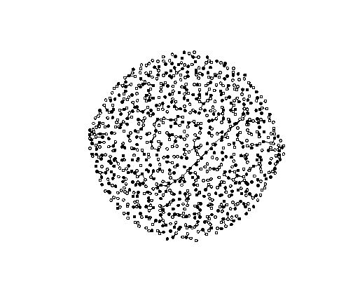
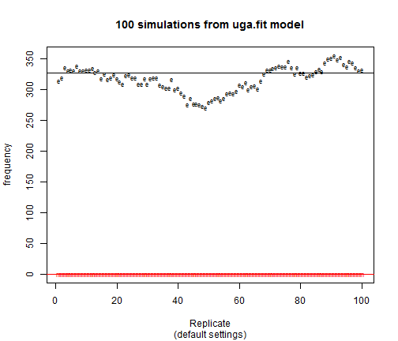
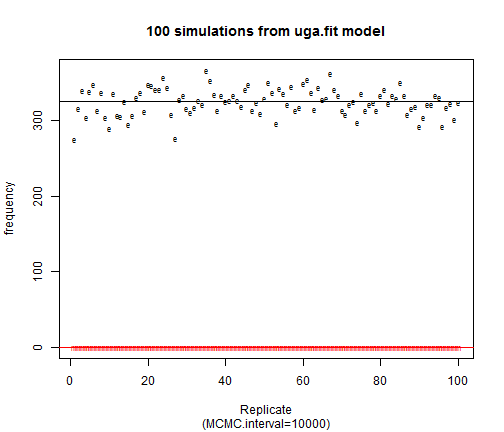
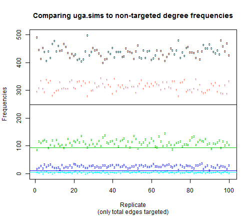

Title
========================================================

This is an R Markdown document. Markdown is a simple formatting syntax for authoring web pages (click the **Help** toolbar button for more details on using R Markdown).

When you click the **Knit HTML** button a web page will be generated that includes both content as well as the output of any embedded R code chunks within the document. You can embed an R code chunk like this:


```r
# Reproducing the sexual contact network of a sample in Uganda.

rm(list = ls())
graphics.off()

# Packages that we need:
require("statnet")
```

```
## Loading required package: statnet
```

```
## Warning: package 'statnet' was built under R version 3.0.3
```

```
## Loading required package: network
## network: Classes for Relational Data
## Version 1.9.0 created on 2014-01-03.
## copyright (c) 2005, Carter T. Butts, University of California-Irvine
##                     Mark S. Handcock, University of California -- Los Angeles
##                     David R. Hunter, Penn State University
##                     Martina Morris, University of Washington
##                     Skye Bender-deMoll, University of Washington
##  For citation information, type citation("network").
##  Type help("network-package") to get started.
## 
## Loading required package: ergm
## Loading required package: statnet.common
## 
## ergm: version 3.1.2, created on 2014-01-30
## Copyright (c) 2014, Mark S. Handcock, University of California -- Los Angeles
##                     David R. Hunter, Penn State University
##                     Carter T. Butts, University of California -- Irvine
##                     Steven M. Goodreau, University of Washington
##                     Pavel N. Krivitsky, University of Wollongong
##                     Martina Morris, University of Washington
## Based on "statnet" project software (statnet.org).
## For license and citation information see statnet.org/attribution
## or type citation("ergm").
## 
## NOTE: If you use custom ERGM terms based on 'ergm.userterms'
## version prior to 3.1, you will need to perform a one-time update
## of the package boilerplate files (the files that you did not write
## or modify) from 'ergm.userterms' 3.1 or later. See
## help('eut-upgrade') for instructions.
## 
## NOTE: Dynamic network modeling functionality (STERGMs) has been
## moved to a new package, 'tergm'.
## 
## Loading required package: sna
```

```
## Warning: package 'sna' was built under R version 3.0.3
```

```
## sna: Tools for Social Network Analysis
## Version 2.3-2 created on 2014-01-13.
## copyright (c) 2005, Carter T. Butts, University of California-Irvine
##  For citation information, type citation("sna").
##  Type help(package="sna") to get started.
## 
## 
## Attaching package: 'sna'
## 
## The following object is masked from 'package:network':
## 
##     %c%
## 
## Loading required package: networkDynamic
```

```
## Warning: package 'networkDynamic' was built under R version 3.0.3
```

```
## 
## networkDynamic: version 0.6.3, created on 2014-02-27
## Copyright (c) 2014, Carter T. Butts, University of California -- Irvine
##                     Ayn Leslie-Cook, University of Washington
##                     Pavel N. Krivitsky, University of Wollongong
##                     Skye Bender-deMoll, University of Washington
##                     with contributions from
##                     Zack Almquist, University of California -- Irvine
##                     David R. Hunter, Penn State University
##                     Li Wang
##                     Kirk Li, University of Washington
##                     Steven M. Goodreau, University of Washington
##                     Martina Morris, University of Washington
## Based on "statnet" project software (statnet.org).
## For license and citation information see statnet.org/attribution
## or type citation("networkDynamic").
## 
## Loading required package: tergm
## 
## tergm: version 3.1.4, created on 2014-01-16
## Copyright (c) 2014, Pavel N. Krivitsky, University of Wollongong
##                     Mark S. Handcock, University of California -- Los Angeles
##                     with contributions from
##                     David R. Hunter, Penn State University
##                     Steven M. Goodreau, University of Washington
##                     Martina Morris, University of Washington
##                     Nicole Bohme Carnegie, New York University
##                     Carter T. Butts, University of California -- Irvine
##                     Ayn Leslie-Cook, University of Washington
##                     Skye Bender-deMoll
## Based on "statnet" project software (statnet.org).
## For license and citation information see statnet.org/attribution
## or type citation("tergm").
## 
## Loading required package: ergm.count
```

```
## Warning: package 'ergm.count' was built under R version 3.0.3
```

```
## 
## ergm.count: version 3.1.1, created on 2013-03-29
## Copyright (c) 2013, Pavel N. Krivitsky, University of Wollongong
##                     with contributions from
##                     Mark S. Handcock, University of California -- Los Angeles
##                     David R. Hunter, Penn State University
## Based on "statnet" project software (statnet.org).
## For license and citation information see statnet.org/attribution
## or type citation("ergm.count").
## 
## Loading required package: latentnet
```

```
## Warning: package 'latentnet' was built under R version 3.0.3
```

```
## 
## latentnet: version 2.5.1, created on 2014-02-17
## Copyright (c) 2014, Pavel N. Krivitsky, University of Wollongong
##                     Mark S. Handcock, University of California -- Los Angeles
##                     with contributions from
##                     Susan M. Shortreed
##                     Jeremy Tantrum
##                     Peter D. Hoff
## Based on "statnet" project software (statnet.org).
## For license and citation information see statnet.org/attribution
## or type citation("latentnet").
## 
## 
## Attaching package: 'latentnet'
## 
## The following object is masked from 'package:base':
## 
##     scale
## 
## 
## statnet: version 2014.2.0, created on 2014-02-05
## Copyright (c) 2014, Mark S. Handcock, University of California -- Los Angeles
##                     David R. Hunter, Penn State University
##                     Carter T. Butts, University of California -- Irvine
##                     Steven M. Goodreau, University of Washington
##                     Pavel N. Krivitsky, University of Wollongong
##                     Skye Bender-deMoll
##                     Martina Morris, University of Washington
## Based on "statnet" project software (statnet.org).
## For license and citation information see statnet.org/attribution
## or type citation("statnet").
```

```r
require("coda")
```

```
## Loading required package: coda
```

```
## Warning: package 'coda' was built under R version 3.0.3
```

```
## Loading required package: lattice
## 
## Attaching package: 'coda'
## 
## The following object is masked from 'package:latentnet':
## 
##     as.mcmc
```

```r


# Creating the empty netwrok with 500 male and 400 female.
ego.net <- network.initialize(900, directed = F)
ego.net %v% "sex" <- c(rep(0, 500), rep(1, 400))

# Degree distribution of nodes based on the Measure DHS data in Uganda
# (2004)
ego.deg <- c(248, 543, 93, 11, 5)  #Node distribution
# The assumption is that population is hetrosexual. Following command, shows
# how number of reported partners are defferent among men and women.
ego.mixmat <- matrix(c(0, 360, 292, 0)/2, nrow = 2, byrow = T)
# Total number of edges(Sexual contacts)
ego.edges <- sum(ego.mixmat)
# Total number of homosexual contacts, which is zero
ego.sexmatch <- ego.mixmat[1, 1] + ego.mixmat[2, 2]
# Target statistics for the model
ego.target.stats <- c(ego.edges, ego.sexmatch)
ego.target.stats
```

```
## [1] 326   0
```

```r

# Building an ERGM model based on the edges and hetrosexuality in the
# population
ego.fit <- ergm(ego.net ~ edges + nodematch("sex"), target.stats = ego.target.stats)
```

```
## Observed statistic(s) nodematch.sex are at their smallest attainable values. Their coefficients will be fixed at -Inf.
```

```r
summary(ego.fit)
```

```
## 
## ==========================
## Summary of model fit
## ==========================
## 
## Formula:   nw ~ edges + nodematch("sex")
## <environment: 0x000000000b160538>
## 
## Iterations:  20 
## 
## Monte Carlo MLE Results:
##               Estimate Std. Error MCMC % p-value    
## edges          -6.4175     0.0554     NA  <1e-04 ***
## nodematch.sex     -Inf         NA     NA      NA    
## ---
## Signif. codes:  0 '***' 0.001 '**' 0.01 '*' 0.05 '.' 0.1 ' ' 1
## 
##      Null Deviance: 560825  on 404550  degrees of freedom
##  Residual Deviance: 288403  on 404548  degrees of freedom
##  
## AIC: 288407    BIC: 288429    (Smaller is better.) 
## 
##  Warning: The following terms have infinite coefficient estimates:
##   nodematch.sex
```

```r

# Simulation of the current network from the ERGM model
ego.sim1 <- simulate(ego.fit)
```


```r
plot(ego.sim1, vertex.cex = 0.65, vertex.col = "sex")
```

 

#Comparing model results with observed data

```r
rbind(sim = summary(ego.sim1 ~ degree(c(0:4))), obs = ego.deg)
```

```
##     degree0 degree1 degree2 degree3 degree4
## sim     418     332     114      31       4
## obs     248     543      93      11       5
```

```r
mixingmatrix(ego.sim1, "sex")
```

```
## Note:  Marginal totals can be misleading
##  for undirected mixing matrices.
##     0   1
## 0   0 337
## 1 337   0
```

```r
ego.mixmat
```

```
##      [,1] [,2]
## [1,]    0  180
## [2,]  146    0
```

```r

# We simulate the ergm model for 100 times to see if observed data matches
# the model results
ego.sim100 <- simulate(ego.fit, nsim = 100)
ego.sim100
```

```
## Number of Networks: 100 
## Model: nw ~ edges + nodematch("sex") 
## Reference: ~Bernoulli 
## Constraints: ~. 
## Parameters:
##         edges nodematch.sex 
##        -6.418    -10000.000
```

```r

summary(ego.sim100)
```

```
## Number of Networks: 100 
## Model: nw ~ edges + nodematch("sex") 
## Reference: ~Bernoulli 
## Constraints: ~. 
## Parameters:
##         edges nodematch.sex 
##        -6.418    -10000.000 
## 
## Stored network statistics:
##        edges nodematch.sex
##   [1,]   349             0
##   [2,]   348             0
##   [3,]   353             0
##   [4,]   358             0
##   [5,]   367             0
##   [6,]   356             0
##   [7,]   367             0
##   [8,]   381             0
##   [9,]   375             0
##  [10,]   375             0
##  [11,]   373             0
##  [12,]   372             0
##  [13,]   376             0
##  [14,]   364             0
##  [15,]   368             0
##  [16,]   370             0
##  [17,]   361             0
##  [18,]   340             0
##  [19,]   344             0
##  [20,]   348             0
##  [21,]   352             0
##  [22,]   344             0
##  [23,]   350             0
##  [24,]   353             0
##  [25,]   358             0
##  [26,]   351             0
##  [27,]   342             0
##  [28,]   343             0
##  [29,]   337             0
##  [30,]   337             0
##  [31,]   334             0
##  [32,]   338             0
##  [33,]   332             0
##  [34,]   331             0
##  [35,]   315             0
##  [36,]   322             0
##  [37,]   321             0
##  [38,]   325             0
##  [39,]   322             0
##  [40,]   324             0
##  [41,]   318             0
##  [42,]   309             0
##  [43,]   313             0
##  [44,]   307             0
##  [45,]   318             0
##  [46,]   318             0
##  [47,]   328             0
##  [48,]   325             0
##  [49,]   325             0
##  [50,]   335             0
##  [51,]   332             0
##  [52,]   328             0
##  [53,]   336             0
##  [54,]   339             0
##  [55,]   327             0
##  [56,]   327             0
##  [57,]   323             0
##  [58,]   326             0
##  [59,]   325             0
##  [60,]   325             0
##  [61,]   316             0
##  [62,]   319             0
##  [63,]   315             0
##  [64,]   318             0
##  [65,]   319             0
##  [66,]   311             0
##  [67,]   321             0
##  [68,]   319             0
##  [69,]   307             0
##  [70,]   305             0
##  [71,]   303             0
##  [72,]   309             0
##  [73,]   308             0
##  [74,]   311             0
##  [75,]   326             0
##  [76,]   326             0
##  [77,]   317             0
##  [78,]   315             0
##  [79,]   322             0
##  [80,]   333             0
##  [81,]   338             0
##  [82,]   331             0
##  [83,]   334             0
##  [84,]   336             0
##  [85,]   332             0
##  [86,]   337             0
##  [87,]   324             0
##  [88,]   320             0
##  [89,]   318             0
##  [90,]   319             0
##  [91,]   330             0
##  [92,]   329             0
##  [93,]   337             0
##  [94,]   338             0
##  [95,]   326             0
##  [96,]   326             0
##  [97,]   328             0
##  [98,]   326             0
##  [99,]   325             0
## [100,]   321             0
```

```r

# Compare the model results with observed data
sim.stats <- attr(ego.sim100, "stats")
rbind(sim = colMeans(sim.stats), obs = ego.target.stats)
```

```
##     edges nodematch.sex
## sim 333.6             0
## obs 326.0             0
```


```r
# Model results look pretty close to the observed data
matplot(1:nrow(sim.stats), sim.stats, pch = c("e", "m", "0", "+"), cex = 0.65, 
    main = "100 simulations from ego.fit model", sub = "(default settings)", 
    xlab = "Replicate", ylab = "frequency")
abline(h = ego.target.stats, col = c(1:2))
```

 

```r
# The lines show the target statistics in the observed data To get rid of
# the auto correlation. We increase MCMC interval to get more indeoendent
# realization.
```


```r
ego.sim100 <- simulate(ego.fit, nsim = 100, control = control.simulate.ergm(MCMC.interval = 10000))
sim.stats <- attr(ego.sim100, "stats")
```


```r
matplot(1:nrow(sim.stats), sim.stats, pch = c("e", "m"), cex = 0.65, main = "100 simulations from ego.fit model", 
    sub = "(MCMC.interval=10000)", xlab = "Replicate", ylab = "frequency")
abline(h = ego.target.stats, col = c(1:2))
```

 

```r
# Total edges randomly distributed around the observed data and there is no
# autocorrelation
```


#Now we will fit the degree distribution.

```r
sim.fulldeg <- summary(ego.sim100 ~ degree(c(0:10)))
colnames(sim.fulldeg) <- paste("deg", 0:10, sep = "")
sim.fulldeg[1:5, ]
```

```
##      deg0 deg1 deg2 deg3 deg4 deg5 deg6 deg7 deg8 deg9 deg10
## [1,]  461  304  103   29    2    1    0    0    0    0     0
## [2,]  391  337  119   46    6    1    0    0    0    0     0
## [3,]  462  314   91   29    3    1    0    0    0    0     0
## [4,]  432  334  103   28    3    0    0    0    0    0     0
## [5,]  437  312  116   32    1    2    0    0    0    0     0
```

```r

# The data shows that less than 0.1% of population, have more than 4
# partners. We put them in 4+degree been
sim.deg <- cbind(sim.fulldeg[, 1:4], apply(sim.fulldeg[, 5:11], 1, sum))
colnames(sim.deg) <- c(colnames(sim.fulldeg)[1:4], "degree4+")
rbind(sim = colMeans(sim.deg), obs = ego.deg)
```

```
##      deg0  deg1  deg2  deg3 degree4+
## sim 438.6 314.7 112.8 27.87     5.99
## obs 248.0 543.0  93.0 11.00     5.00
```

#Results show that the the difference between the results of single simulation
#and observed data is quite large.

#plot the degree distribution for the observed data in line 
#and simulated results in numbers.

```r
matplot(1:nrow(sim.deg), sim.deg, pch = as.character(0:4), cex = 0.5, main = "Comparing ego.sims to non-targeted degree frequencies", 
    sub = "(only total edges targeted)", xlab = "Replicate", ylab = "Frequencies")
abline(h = c(248, 543, 93, 11, 5), col = c(1:5))
```

 


```r
# We refit the model with targeting degree 0 people
ego.isolates <- ego.deg[1]
ego.target.stats <- c(ego.edges, ego.sexmatch, ego.isolates)
ego.fit <- ergm(ego.net ~ edges + nodematch("sex") + degree(0), target.stats = ego.target.stats)
```

```
## Observed statistic(s) nodematch.sex are at their smallest attainable values. Their coefficients will be fixed at -Inf.
## Iteration 1 of at most 20: 
## Convergence test P-value: 3.2e-01 
## The log-likelihood improved by 0.001685 
## Iteration 2 of at most 20: 
## Convergence test P-value: 9.7e-01 
## Convergence detected. Stopping.
```

```
## Warning: Approximate Hessian matrix is singular. Standard errors due to
## MCMC approximation of the likelihood cannot be evaluated. This is likely
## due to highly correlated model terms.
```

```
## The log-likelihood improved by < 0.0001
```

```
## Warning: Observed statistic(s) nodematch.sex are at their smallest
## attainable values and drop=FALSE. The MLE is poorly defined.
```

```
## 
## This model was fit using MCMC.  To examine model diagnostics and check for degeneracy, use the mcmc.diagnostics() function.
```

```r

summary(ego.fit)
```

```
## 
## ==========================
## Summary of model fit
## ==========================
## 
## Formula:   nw ~ edges + nodematch("sex") + degree(0)
## <environment: 0x000000000cd3ec78>
## 
## Iterations:  20 
## 
## Monte Carlo MLE Results:
##               Estimate Std. Error MCMC % p-value    
## edges         -44.1858     0.0330     NA  <1e-04 ***
## nodematch.sex     -Inf         NA     NA      NA    
## degree0       -20.2514     0.0661     NA  <1e-04 ***
## ---
## Signif. codes:  0 '***' 0.001 '**' 0.01 '*' 0.05 '.' 0.1 ' ' 1
## 
## Warning:  The standard errors are suspect due to possible poor convergence.
## 
##      Null Deviance: 560825  on 404550  degrees of freedom
##  Residual Deviance:    NaN  on 404547  degrees of freedom
##  
## AIC: NaN    BIC: NaN    (Smaller is better.) 
## 
##  Warning: The following terms have infinite coefficient estimates:
##   nodematch.sex
```

```r

ego.sim100 <- simulate(ego.fit, nsim = 100, control = control.simulate.ergm(MCMC.interval = 10000))
sim.stats <- attr(ego.sim100, "stats")
rbind(sim = colMeans(sim.stats), obs = ego.target.stats)
```

```
##     edges nodematch.sex degree0
## sim 325.7             0   248.5
## obs 326.0             0   248.0
```

```r

sim.fulldeg <- summary(ego.sim100 ~ degree(c(0:10)))
sim.deg <- cbind(sim.fulldeg[, 1:4], apply(sim.fulldeg[, 5:11], 1, sum))
colnames(sim.deg) <- c(colnames(sim.fulldeg)[1:4], "degree4+")
rbind(sim = colMeans(sim.deg), obs = ego.deg)
```

```
##     degree0 degree1 degree2 degree3 degree4+
## sim   248.5   651.5       0       0        0
## obs   248.0   543.0      93      11        5
```


```r
matplot(1:nrow(sim.deg), sim.deg, pch = as.character(0:3), cex = 0.5, main = "Comparing ego.sims to non-targeted degree frequencies", 
    sub = "(only 0, 2+ and total edges targeted)", xlab = "Replicate", ylab = "Frequencies")
abline(h = c(248, 543, 93, 11, 5), col = c(1:5))
```

 


